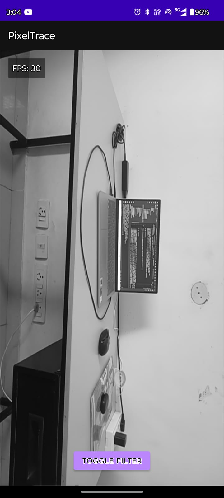

# PixelTrace - Real-time Edge Detection on Android 🚀

PixelTrace is a high-performance Android application that captures a live video feed 
from the device's camera and applies a Canny edge detection filter in real-time. 
This project was developed as a deep dive into mobile computer vision, 
demonstrating a full pipeline from camera capture to native processing and GPU rendering.

## 📸 Screenshots

|   Filter On (Canny Edge Detection)    |       Filter Off (Raw Grayscale)       |
|:-------------------------------------:|:--------------------------------------:|
|  |  |

## ✨ Features

* **Live Camera Feed**: Utilizes the CameraX API for efficient and robust real-time video capture.
* **Native C++ Processing**: Leverages the performance of C++ for the core image processing logic via the JNI.
* **OpenCV Edge Detection**: Implements the Canny algorithm from the OpenCV library to accurately detect edges in the video stream.
* **High-Performance OpenGL ES Rendering**: Renders the processed frames directly to a `GLSurfaceView` to ensure a smooth, high-FPS experience, bypassing the slower standard Android UI drawing pipeline.
* **Real-time FPS Counter**: An on-screen counter to monitor the application's rendering performance.
* **Toggle Filter Button**: A UI button that allows the user to instantly switch between the processed Canny edge output and the original grayscale feed to compare results.

---

## 🏛️ Architecture

The application is built on a pipeline architecture designed to maximize performance and separate concerns:

1.  **CameraX (Java)**: Captures `YUV_420_888` image frames from the camera on a background thread.
2.  **JNI Bridge (Java/C++)**: A crucial layer that allows the Java code to communicate with the native C++ functions, passing frame data for processing.
3.  **OpenCV (C++)**: In the native layer, the powerful OpenCV library receives the grayscale image data and applies the `cv::Canny` function for edge detection.
4.  **OpenGL ES (Java/GLSL)**: The final processed frame is uploaded to the GPU as a texture and rendered efficiently onto a `GLSurfaceView`. This avoids the overhead of creating Bitmaps and using `ImageView`, which is critical for real-time video.

This architecture ensures that the computationally intensive processing happens in the native layer, while the GPU handles rendering, keeping the main UI thread free and responsive.

---

## 🛠️ Setup and Build Instructions

1.  **Clone the repository**:
    ```bash
    git clone <your-repository-url>
    ```
2.  **Open in Android Studio**: Open the cloned project in the latest version of Android Studio.
3.  **Install NDK/CMake**: If not already installed, Android Studio will prompt you to install the required NDK and CMake build tools.
4.  **Sync and Run**: Allow Gradle to sync the project dependencies. Once complete, click the "Run" button to build and install the application on a connected Android device or emulator.

---

## 🧠 Challenges & Learnings

* **NDK and OpenCV Configuration**: Integrating OpenCV with Android Studio's NDK was a significant learning curve. It required a deep understanding of `CMakeLists.txt` to correctly link the OpenCV libraries with the native C++ code and ensure Gradle could build the entire project successfully.
* **OpenGL Threading**: A key technical challenge was an `EGL_BAD_CONTEXT` error. This occurred because OpenGL commands were being called from the camera's processing thread instead of the dedicated GL rendering thread. The problem was solved by implementing a two-function native architecture: one function to cache frame data from the camera thread, and a second to upload the texture on the correct GL thread (`onDrawFrame`).
* **Camera Orientation**: The raw camera feed was initially rotated by 90 degrees. This was corrected by transforming the texture coordinates (`texCoords`) in the `MyGLRenderer`, which was a great exercise in understanding graphics transformations.